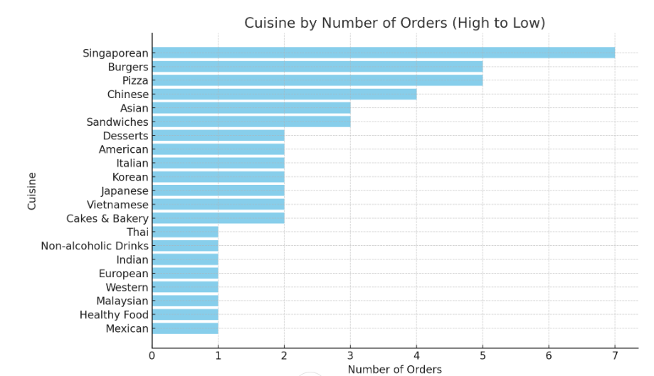
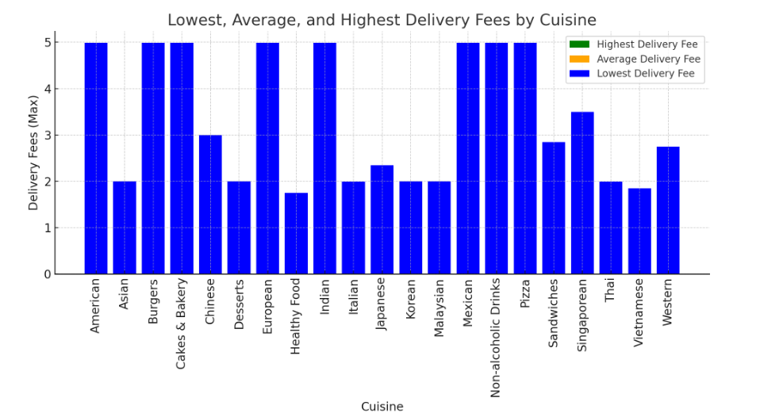
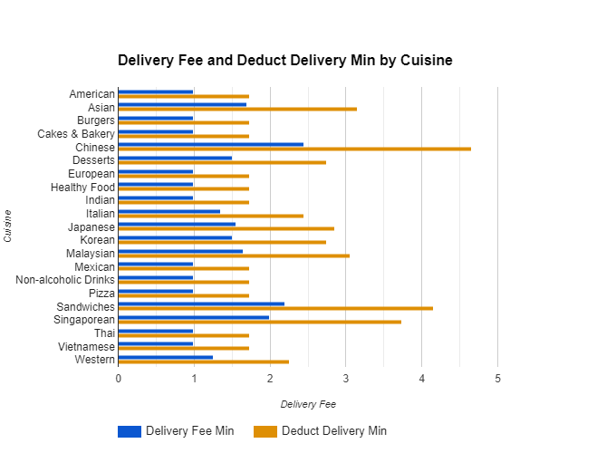
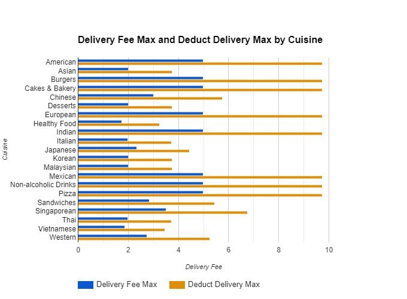

# SQL Food -Recommendation-system

## Introduction:

The **Food Recommendation** dataset is a structured collection of data related to customer food orders, designed to provide insights into cuisine preferences, delivery fees, and commission structures within the food delivery industry. This dataset focuses on various cuisines, capturing important metrics like the number of orders, customer IDs, commission rates, and dynamic delivery fees (both minimum and maximum).

### Key columns in the dataset include:

- **Cuisine:** The type of food ordered (e.g., Fast Food, Chinese, Indian).

- **Number of Orders:** The total count of orders for each cuisine.

- **Customer ID:** A unique identifier representing customers.

- **Commission Rate:** The rate at which commissions are applied to the delivery charges.

- **Delivery Fee Min/Max:** The range of delivery fees applied to each order.

Additionally, derived columns such as **deduct_delivery_min** and **deduct_delivery_max** reflect automatic deductions applied based on the commission rate, enabling further analysis of the actual delivery costs. Moreover, the **difference_1** and **difference_2** columns provide insights into how these deductions affect delivery fee calculations.

The dataset aims to help businesses and analysts understand customer behavior, delivery fee structures, and how commissions impact final costs. By leveraging this data, it becomes possible to optimize pricing models, identify popular cuisines, and enhance the overall customer experience.

SQL check report here: [New_Overview](/New_Overview/) And [Commission_Fee](/Commission_Fee/)

## Background

The **Food Recommendation** dataset was created in response to the growing demand for data-driven insights within the food delivery industry. With the rapid rise of online food ordering platforms, restaurants and delivery services face increasing pressure to optimize operations, understand customer preferences, and maintain profitability.

One critical area of focus is understanding how different cuisines perform in terms of customer orders, delivery fees, and commissions. To address this, the dataset was designed to capture a wide range of metrics including the types of cuisines ordered, frequency of orders, delivery fee ranges, and how commission rates impact both delivery fees and restaurant margins.

Restaurants often adjust their delivery fees based on factors like location, delivery time, and order volume. Meanwhile, the platform's commission, typically a percentage of the transaction, directly influences the cost passed on to customers. By analyzing these relationships, businesses can identify trends, optimize pricing strategies, and ensure that both restaurants and delivery platforms remain profitable without alienating customers.

The inclusion of derived columns such as **deduct_delivery_min**, **deduct_delivery_max**, and the differences between original and deducted values helps stakeholders gain a deeper understanding of how commission structures affect both pricing and profitability. Ultimately, this dataset serves as a valuable tool for data analysts, restaurant owners, and delivery service providers aiming to enhance customer satisfaction while maximizing efficiency and revenue.

This background establishes the need for the dataset and its relevance in the context of modern food delivery logistics and pricing strategies.

## Tools

### This project utilizes several key tools to manage and analyze the data:

- **SQL:** Used to script and query data for analysis.
- **PostgreSQL:** Serves as the database management system for storing and organizing job postings
data.
- **VS Code:** Employed for database management and executing SQL queries.
- **Git & GitHub:** Used for version control, collaboration, and project tracking, ensuring seamless teamwork and project management.


## The Analysis

In working with the Food Recommendation dataset, we conducted a comprehensive analysis aimed at understanding key trends in customer ordering patterns, delivery fees, and the impact of commission rates. Below are the major aspects of the analysis:

### Cuisines and Number of Orders:

- We began by examining the distribution of orders across different cuisines. This helped us identify the most popular cuisines (such as Fast Food and Chinese) and those with lower demand (like European and Mexican). Sorting the data by the number of orders allowed us to see which cuisines were most requested and which had the lowest demand.

### Delivery Fee Analysis:

- We performed an in-depth analysis of both **delivery_fee_min** and **delivery_fee_max** across different cuisines. This analysis included:

- Sorting cuisines based on the lowest, average, and highest delivery fees.

- Understanding how delivery fees varied for different cuisines and identifying potential opportunities to optimize fees for certain cuisine types.

- We then looked at the average delivery fees to get an overview of the pricing landscape for deliveries, which could help restaurants adjust their fees in a competitive market.

### Commission Rate Impact:

- We introduced new columns, **deduct_delivery_min** and **deduct_delivery_max,** to account for the commission deduction **(0.25)**. This allowed us to see the adjusted delivery fees after the platform's commission, providing insights into how much profit margin is impacted for each cuisine.

- By calculating and observing these deductions, we were able to see which cuisines might be more heavily impacted by commission fees and how this affects overall delivery pricing.

### Price Differences:

To further extend the analysis, we created two new columns, **difference_1** (related to **deduct_delivery_min**) and **difference_2** (related to **deduct_delivery_max**). These differences allowed us to analyze how much the deducted values differ from the original delivery fees, giving more clarity on the platform’s pricing structure and the real impact of commissions.

### General Trends:
- The analysis also provided insights into customer preferences, particularly which cuisines are more likely to attract repeat customers or higher orders. We identified patterns in order frequency, price ranges, and possible areas where adjustments to delivery fees could either attract more customers or increase revenue for restaurants.

- By correlating the number of orders with the adjusted delivery fees, we can also infer how price sensitivity might affect customer decisions in food ordering.

### cuisine order fro High to low

Here is a visualization of the cuisines sorted by the number of orders, from high to low. The chart highlights that Singaporean cuisine has the highest number of orders, followed by Burgers, Pizza, and Chinese cuisines. 



```sql 
SELECT *
FROM foodrecommendation
ORDER BY number_of_orders ASC;
```

### Cuisine Max by Group ( Deliver Fee)



#### 1 Consistency in Maximum Delivery Fees:

- Many cuisines like **American, Burgers, Cakes & Bakery, Indian, Mexican, Non-alcoholic Drinks**, and **Pizza** have consistent maximum delivery fees of **4.99** across all orders.

- This indicates that the upper bound of delivery fees for these cuisines is likely fixed or standardized.

#### 2 Lower Delivery Fee Categories:

- Cuisines such as **Healthy Food** (1.75), **Italian** (1.99), **Vietnamese** (1.85), **Thai** (1.99), and **Malaysian** (2.00) fall into the lower range of maximum delivery fees.

- This may suggest that these cuisines are either targeted at more price-conscious customers or have more efficient delivery logistics, leading to lower costs.

#### 3 Middle-Range Fees:

- **Sandwiches** (2.85), **Singaporean** (3.50), **Chinese** (3.00), and **Western** (2.75) are in the mid-tier of delivery fees.

- These fees may reflect moderate delivery distances or varying customer demand and service requirements for these types of food.

#### 4 Homogeneity in Average Delivery Fees:

- For most cuisines, the average delivery fees align with either the lowest or the highest delivery fee max. This indicates that delivery fees do not fluctuate much and are relatively stable, especially in high-tier delivery fee cuisines like **American** and **Pizza**.

- It seems there’s little variation between individual orders, at least in terms of the maximum delivery fee.

#### 5 Unique Cuisines with Varied Fees:

- Some cuisines like **Japanese** (2.35), **Singaporean** (3.50), and **Sandwiches** (2.85) offer slightly higher delivery fees than other low-tier cuisines, but lower than the upper-tier fees like those for **American** and **Pizza**.

#### 6 Market Segmentation:

- The table hints at the segmentation of cuisine markets, with certain categories, such as fast food or premium cuisines like **Burgers**, consistently priced at higher delivery fee ranges. Meanwhile, more niche cuisines like **Healthy Food** and **Vietnamese** have lower delivery fee maximums.

#### 7 Possible Price Thresholds:

With several cuisines pegged at the **4.99** maximum delivery fee, this suggests a possible price threshold or cap, where increasing delivery fees beyond this point may reduce customer demand.

### Business Implications:

- **Competitive Pricing:** Businesses offering cuisines like **American**, **Pizza**, and **Burgers** may face stiff competition since their delivery fees are pegged at the highest end.

- **Opportunity for Lower Fee Cuisines:** Cuisines like **Healthy Food** and **Italian** may appeal to more budget-conscious customers, providing an opportunity for businesses to capture market share in these categories with lower delivery fees.

- **Cost Optimization:** For the middle-tier cuisines, such as **Sandwiches** and **Singaporean**, optimizing delivery efficiency could allow them to lower fees and become more competitive.

This analysis provides a foundation for deeper insights into customer behavior and how delivery pricing strategies could be tailored to different cuisine types.

| Cuisine              | Lowest Delivery Fee Max | Average Delivery Fee Max | Highest Delivery Fee Max |
|----------------------|-------------------------|--------------------------|--------------------------|
| American             | 4.99                    | 4.99                     | 4.99                     |
| Asian                | 2.00                    | 2.00                     | 2.00                     |
| Burgers              | 4.99                    | 4.99                     | 4.99                     |
| Cakes & Bakery       | 4.99                    | 4.99                     | 4.99                     |
| Chinese              | 3.00                    | 3.00                     | 3.00                     |
| Desserts             | 2.00                    | 2.00                     | 2.00                     |
| European             | 4.99                    | 4.99                     | 4.99                     |
| Healthy Food         | 1.75                    | 1.75                     | 1.75                     |
| Indian               | 4.99                    | 4.99                     | 4.99                     |
| Italian              | 1.99                    | 1.99                     | 1.99                     |
| Japanese             | 2.35                    | 2.35                     | 2.35                     |
| Korean               | 2.00                    | 2.00                     | 2.00                     |
| Malaysian            | 2.00                    | 2.00                     | 2.00                     |
| Mexican              | 4.99                    | 4.99                     | 4.99                     |
| Non-alcoholic Drinks | 4.99                    | 4.99                     | 4.99                     |
| Pizza                | 4.99                    | 4.99                     | 4.99                     |
| Sandwiches           | 2.85                    | 2.85                     | 2.85                     |
| Singaporean          | 3.50                    | 3.50                     | 3.50                     |
| Thai                 | 1.99                    | 1.99                     | 1.99                     |
| Vietnamese           | 1.85                    | 1.85                     | 1.85                     |
| Western              | 2.75                    | 2.75                     | 2.75                     |

```sql
SELECT 
    cuisine,
    MIN(delivery_fee_max) AS lowest_delivery_fee_max,
    AVG(delivery_fee_max) AS average_delivery_fee_max,
    MAX(delivery_fee_max) AS highest_delivery_fee_max
FROM foodrecommendation
GROUP BY cuisine
ORDER BY cuisine;
```
### Commission and Deduct (Commission Fee)




list of cuisines, detailing the delivery fees (both minimum and maximum) and how much of the delivery fee has been deducted. Each row includes:

- **Cuisine:** The type of cuisine (e.g., American, Asian, Burgers).

- **Delivery Fee Min:** The minimum delivery fee charged.

- **Delivery Fee Max:** The maximum delivery fee charged.

- **Deduct Delivery Min and Max:** The amount left after deducting a portion of the minimum delivery fee (typically **0.25** deducted from the original).

#### Observations:

- **Deduction Consistency:** In most rows, the deduction is consistently **0.25** from both the **delivery_fee_min and delivery_fee_max**. For example, for **"American,"** the original fees are **0.99 and 4.99**, and the deducted fees are **0.74 and 4.74**

- **Price Variation:** The minimum delivery fees range from **0.99** (for cuisines like American, Mexican, and Pizza) to **2.45** for Chinese, while the maximum fees reach up to **4.99** for several cuisines

- **Repetition:** There are duplicate rows for each cuisine (e.g., American, Asian, Burgers appear twice), which might indicate that some data entries were repeated.

#### Actionable Insights:

- **Fee Distribution:** Most cuisines have a minimum fee of **0.99**, which suggests a possible standard lower limit for delivery fees across several categories.

- **Range Analysis:** Cuisines like Chinese and Singaporean show a wider range in delivery fees (higher max fees) compared to others like Thai or Vietnamese, which have lower overall delivery charges. This could suggest differences in operational costs or delivery distances.

| Cuisine               | Delivery Fee Min | Delivery Fee Max | Deduct Delivery Min | Deduct Delivery Max |
|-----------------------|------------------|------------------|---------------------|---------------------|
| American              | 0.99             | 4.99             | 0.74                | 4.74                |
| Asian                 | 1.70             | 2.00             | 1.45                | 1.75                |
| Burgers               | 0.99             | 4.99             | 0.74                | 4.74                |
| Cakes & Bakery        | 0.99             | 4.99             | 0.74                | 4.74                |
| Chinese               | 2.45             | 3.00             | 2.20                | 2.75                |
| Desserts              | 1.50             | 2.00             | 1.25                | 1.75                |
| European              | 0.99             | 4.99             | 0.74                | 4.74                |
| Healthy Food          | 0.99             | 1.75             | 0.74                | 1.50                |
| Indian                | 0.99             | 4.99             | 0.74                | 4.74                |
| Italian               | 1.35             | 1.99             | 1.10                | 1.74                |
| Japanese              | 1.55             | 2.35             | 1.30                | 2.10                |
| Korean                | 1.50             | 2.00             | 1.25                | 1.75                |
| Malaysian             | 1.65             | 2.00             | 1.40                | 1.75                |
| Mexican               | 0.99             | 4.99             | 0.74                | 4.74                |
| Non-alcoholic Drinks  | 0.99             | 4.99             | 0.74                | 4.74                |
| Pizza                 | 0.99             | 4.99             | 0.74                | 4.74                |
| Sandwiches            | 2.20             | 2.85             | 1.95                | 2.60                |
| Singaporean           | 1.99             | 3.50             | 1.74                | 3.25                |
| Thai                  | 0.99             | 1.99             | 0.74                | 1.74                |
| Vietnamese            | 0.99             | 1.85             | 0.74                | 1.60                |
| Western               | 1.25             | 2.75             | 1.00                | 2.50                |

```sql
SELECT
    cuisine,
    delivery_fee_min,
    delivery_fee_max,
    deduct_delivery_min,
    deduct_delivery_max
FROM foodrecommendation
ORDER BY cuisine;
```

## Learning Point

### Delivery Fee Variability by Cuisine:

- Different cuisines have varying delivery fees, both in terms of the minimum and maximum fees. For example, cuisines like **American, Burgers,** and **Mexican** tend to have higher maximum delivery fees, while cuisines like **Vietnamese, Thai,** and **Healthy Food** have lower delivery fees.

### Deducted Delivery Fees:

- The **"Deduct Delivery"** columns show that the deduction amount from both minimum and maximum delivery fees is consistent across all cuisines **(0.25)**. This suggests that there's a uniform policy or system applied to adjust the delivery fees across different types of food.

### Data Analysis and Structure:

- When analyzing data like this, it is important to break down columns into meaningful categories for easy comparison (e.g., **Delivery Fee Min, Delivery Fee Max, Deduct Delivery Min**, etc.). This helps in identifying patterns or trends across the dataset, such as how much customers typically pay for delivery depending on the cuisine.

### Effective Visualization:
- Visualizing data with a bar chart helps quickly compare fees across different cuisines. Visuals can often communicate trends more effectively than raw data alone, allowing for easier interpretation of which cuisines have higher or lower delivery costs.

### Patterns in Deducted Delivery Fees:
- The consistent difference of 0.25 across all delivery fees might indicate a fixed commission or service charge being deducted from the delivery fees, which could be useful for business insights into how fees are structured across various cuisines.

This process illustrates the importance of both data preparation and visualization in making raw information accessible and actionable.

## Summary

The analysis provided a clear understanding of how various factors, such as commission rates and delivery fees, interact with customer preferences and ordering behavior. This will be instrumental in helping restaurants and platforms refine their pricing strategies, optimize commissions, and ultimately enhance customer satisfaction while maintaining profitability.

# The END